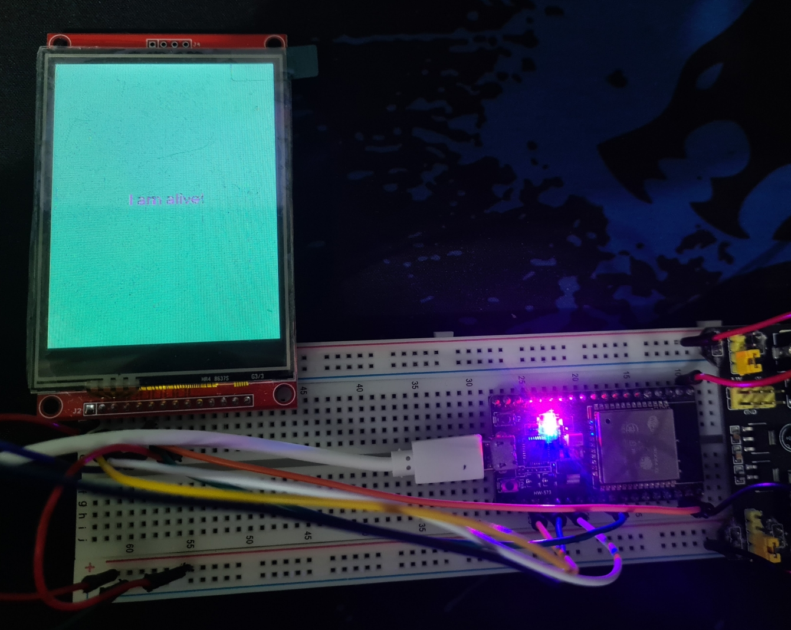

[](https://github.com/marconvtr/tft-webserver/blob/main/README.md)
[](https://github.com/marconvtr/tft-webserver/blob/main/README.pt-br.md)

## WIP: ESP32 ILI9341 Webserver Experiment

Este é apenas um projeto experimental para ver os limites de um ESP32, tem como intuito colocar um série de rotinas e protocolos



## Requerimentos

* esp-idf
* qualquer placa de desenvolvimento esp32
* quase qualquer TFT é suportado

Este projeto usa uma nodemcu baratinha simples com 4MB de flash, um modelo bem simples, nada de especial, voce pode usar outros modelos de esp32 e configurar simplesmente com o comando.

```
idf.py menuconfig
```

e configurando sua SPI, Clocks, Flash, etctera

## Experimentando

just 

```
git clone --recurse-submodules  https://github.com/marconvtr/tft-webserver.git
```

Configurando os pinos do TFT 


```
idf.py menuconfig -> components config -> lvgl tft config 
```
padrão (23 MOSI, 18 CLK, 15 CS, 2 DC 4 RESET)

Quandoto estiver OK

```
idf.py build
```

